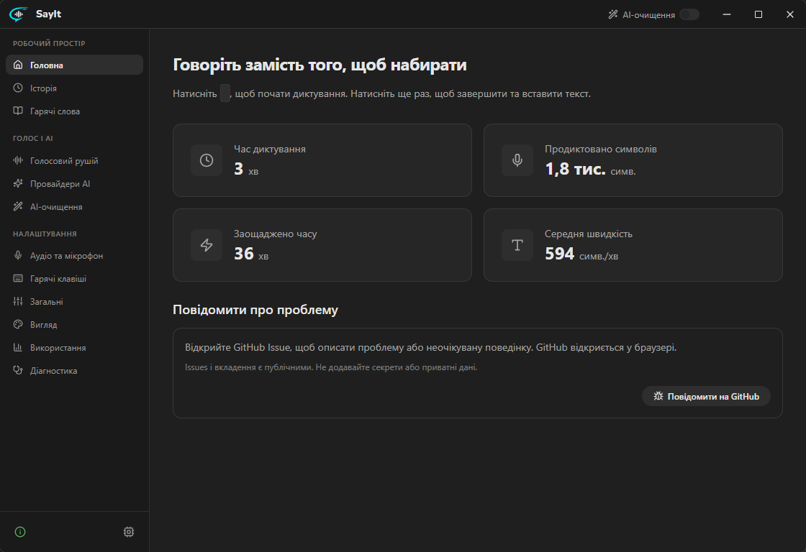
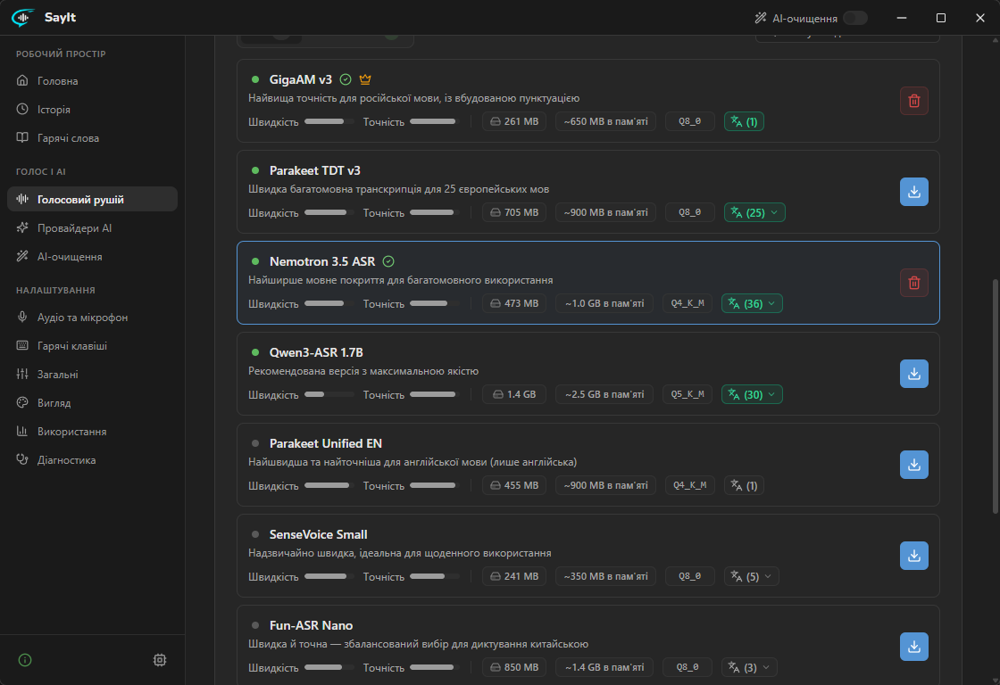
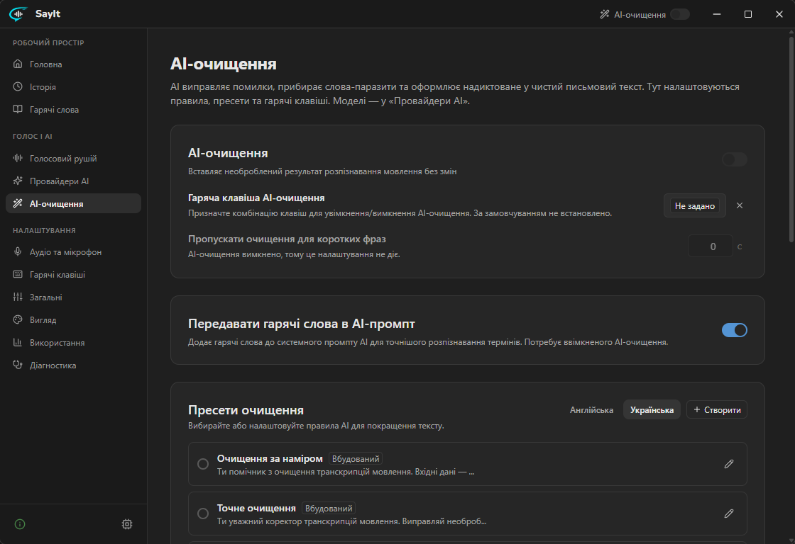
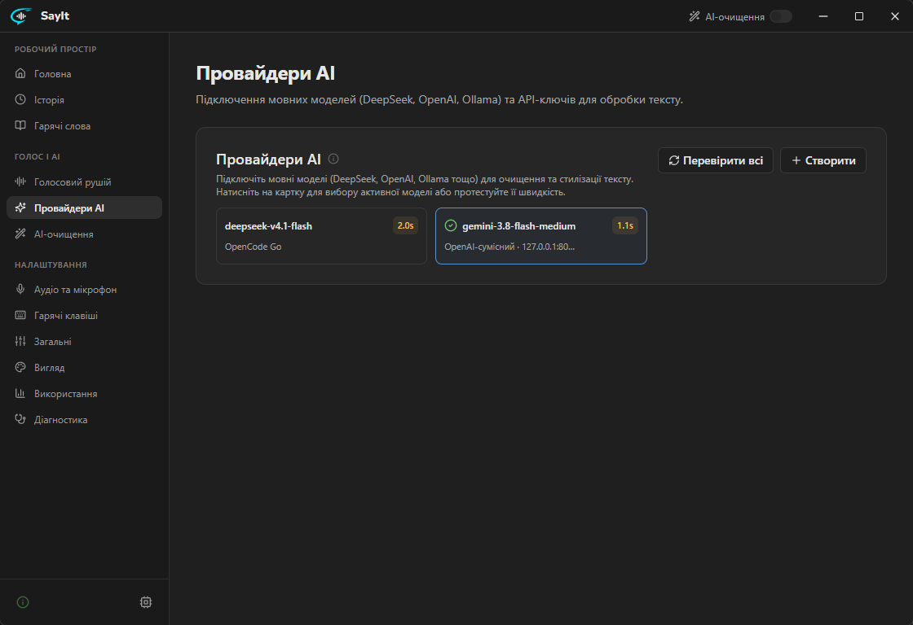
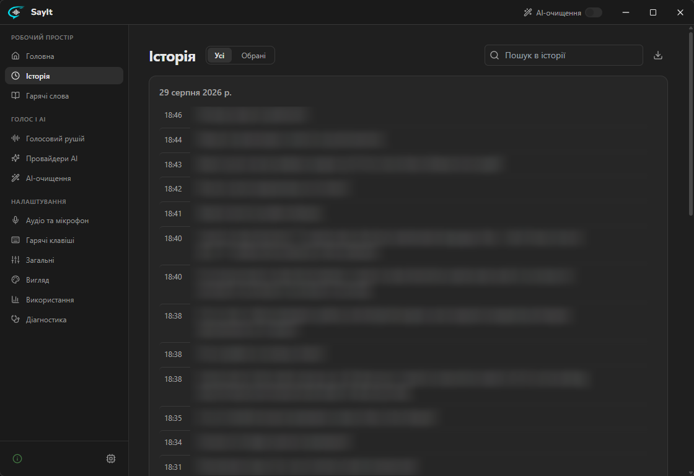
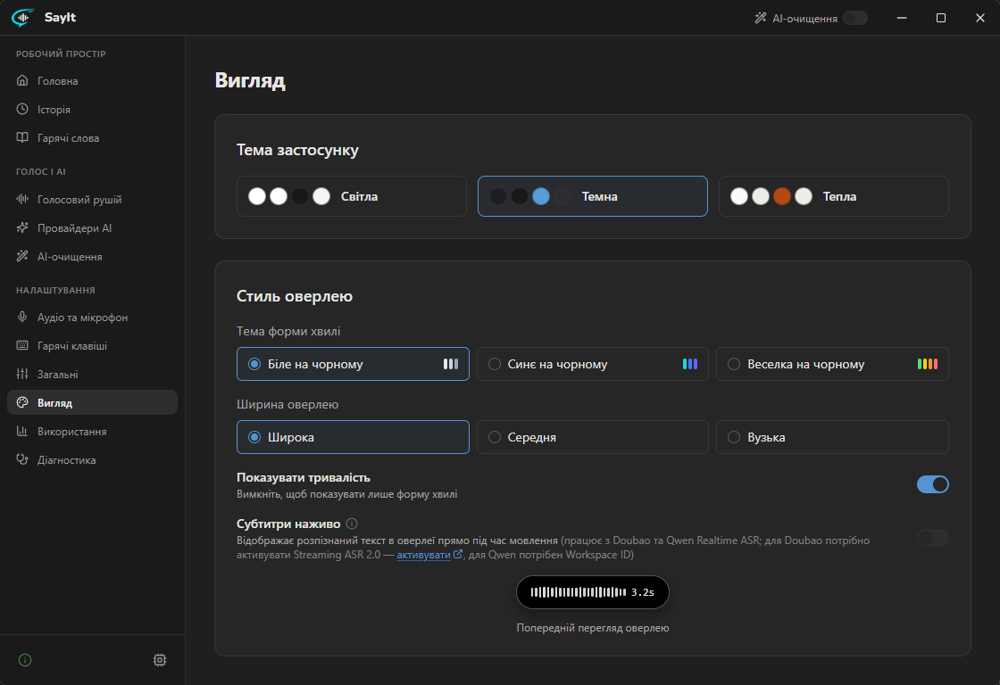

<div align="center">

**Українська** · [English](README.en.md)


# SayIt

Голосове введення з відкритим вихідним кодом для Windows. Натисніть гарячу клавішу та говоріть — SayIt розпізнає мовлення, покращує текст за допомогою AI і вставляє готовий текст прямо туди, де стоїть курсор.

[](./LICENSE)
[](https://github.com/catgirl3d/SayIt/releases/latest)
[](https://github.com/catgirl3d/SayIt/releases/latest)

**[Завантажити для Windows](https://github.com/catgirl3d/SayIt/releases/latest)**

</div>

## Особливості форку

Цей проєкт — підтримуваний форк [crosswk/SayIt](https://github.com/crosswk/SayIt). Завантажити інсталятор для Windows можна в розділі [Releases](https://github.com/catgirl3d/SayIt/releases/latest), а повний перелік змін та покращень — у [журналі оновлень](CHANGELOG-FORK.md).

**Мови диктування:** SayIt підтримує англійську, українську, російську та китайську. Вбудовані промпти для AI-очищення доступні англійською та українською; потрібний варіант можна вибрати в налаштуваннях AI. За замовчуванням використовується мова інтерфейсу. Мову розпізнавання (ASR) можна вибрати окремо — достатньо обрати модель, що підтримує потрібну мову.

## Чому SayIt?

Набір тексту на клавіатурі часто залишається найповільнішим етапом взаємодії з комп'ютером та AI. SayIt перетворює живу мову на якісний готовий текст і водночас залишає вам повний контроль над ключовими налаштуваннями:

- **Голосове введення всюди** — диктуйте в текстових редакторах, месенджерах, браузерах і будь-яких інших програмах для Windows.
- **Гнучке AI-очищення** — прибирайте слова-паразити, виправляйте огріхи розпізнавання, структуруйте думки або зберігайте дослівну транскрипцію. Кожен системний промпт можна адаптувати під себе.
- **Контекстне введення** (за замовчуванням вимкнено) — зчитує текст навколо курсора, щоб нові речення відповідали тону та термінології вашого документа. Якщо перед диктуванням виділити фрагмент тексту, сказане можна використати як інструкцію: перекласти, скоротити, переписати або підготувати відповідь. Результат автоматично замінить виділений фрагмент. Поля введення паролів автоматично ігноруються.
- **Гнучке розпізнавання мовлення** — підключайте хмарні ASR-сервіси, запускайте локальні GGUF-моделі на своєму GPU, використовуйте публічний тестовий сервер або розгортайте автономний бекенд.
- **Інтерфейс українською та англійською** — застосунок автоматично підхоплює мову системи, мову інтерфейсу можна будь-коли змінити в налаштуваннях.
- **Словник підказок (hotwords) і правила для програм** — покращуйте розпізнавання імен, назв та специфічних термінів, а також автоматично змінюйте правила очищення залежно від активної програми.
- **Зручний оверлей** — компактний плаваючий віджет з індикатором рівня звуку показує стан запису й таймер, а також може виводити субтитри в реальному часі прямо під час мовлення.
- **Прозора обробка даних** — застосунок чітко показує активний режим і те, куди саме спрямовуються аудіо та текст.
- **Локальна історія та діагностика** — переглядайте записи, повторно запускайте розпізнавання та формуйте діагностичні звіти, щоб швидше знаходити й усувати проблеми.

## Режими роботи

| Режим | Для чого підходить | Потік даних |
| --- | --- | --- |
| **Локальний режим** | Повна приватність і робота без інтернету | Розпізнавання відбувається повністю на вашому ПК. Якщо вимкнути AI-очищення, жодні дані не залишають пристрій. |
| **Хмарний API** | Швидке розпізнавання без локальних моделей | Застосунок напряму звертається до вибраних провайдерів ASR та AI без проміжних серверів SayIt. |
| **Власний сервер** | Робота в команді або керована інфраструктура | Аудіо обробляється на вашому бекенді SayIt (або тестовим публічним сервером для швидкого старту). |

У каталозі локальних моделей доступно 15 оптимізованих GGUF-моделей із підтримкою GPU-прискорення: Parakeet Unified EN, Parakeet TDT v3 та 1.1B, SenseVoice Small, Fun-ASR Nano та MLT Nano, Nemotron 3.5 ASR (40 мов), GigaAM v3 (RNN-T і CTC), Qwen3-ASR 0.6B та дві квантовані версії 1.7B, а також Whisper Small, Large v3 і Large v3 Turbo. Для хмарного розпізнавання підтримуються Doubao, Qwen, Xiaomi MiMo та Groq Whisper; AI-очищення працює з DeepSeek, Qwen, Doubao, Groq, MiMo, Ollama та будь-якими OpenAI-сумісними API.

## Огляд інтерфейсу

<div align="center">



*Головний екран — статистика диктування, активна комбінація клавіш і посилання на GitHub для зворотного зв'язку.*

<br>



*Голосовий рушій — перемикання між локальним, хмарним або серверним режимом, завантаження моделей розпізнавання. Доступні GPU визначаються автоматично.*

<br>



*AI-очищення — редагування вбудованих пресетів і налаштування правил для програм, які автоматично змінюють правила очищення залежно від активної програми.*

<br>



*AI-провайдери — додавання власних API-ключів, підключення будь-яких OpenAI-сумісних сервісів та вимірювання затримки відгуку прямо в картці моделі.*

<br>



*Історія — зручний локальний архів записів із пошуком. Кожен запис можна розгорнути для перегляду вихідного тексту ASR, таймінгів, прослуховування аудіо чи повторного розпізнавання.*

<br>



*Зовнішній вигляд — вибір тем інтерфейсу, кольорів індикатора запису, налаштування ширини оверлею та субтитрів у реальному часі з інтерактивним прев'ю.*

</div>

## Початок роботи

1. Завантажте останню версію [інсталятора для Windows](https://github.com/catgirl3d/SayIt/releases/latest).
2. Відкрийте SayIt і виберіть голосовий рушій. Щоб швидко спробувати SayIt, скористайтеся тестовим сервером, вибраним за замовчуванням.
3. Натисніть гарячу клавішу в будь-якому застосунку та почніть говорити. За замовчуванням перше натискання вмикає запис, а повторне — зупиняє його; також можна налаштувати режим диктування з утриманням клавіші.

Для щоденного використання оберіть локальний режим або вкажіть власні API-ключі хмарних провайдерів у налаштуваннях. Посилання на консолі сервісів розташовані поруч із кожним полем введення токена.

## Власний сервер (Self-hosting)

Бекенд поєднує FastAPI, потокове передавання через WebSocket, Qwen3-ASR та опціональну модель очищення через OpenAI-сумісний API. Рекомендований спосіб розгортання — Docker Compose.

```bash
git clone https://github.com/catgirl3d/SayIt.git
cd SayIt/server
cp config.example.yaml config.yaml
cp .env.example .env
# Вкажіть налаштування провайдерів і параметри розгортання в .env/config.yaml
docker compose up -d --build
```

Докладніше про налаштування, розгортання, безпеку та API читайте в [посібнику із сервера](server/README.md).

## Розробка

### Десктопний клієнт

```bash
cd client
npm install
npm run tauri dev
```

Вимоги: Node.js 18+, Rust 1.75+, CMake 3.20+ та Vulkan SDK. Перша компіляція нативного рушія C++ займає близько 20 хвилин, а завдяки кешу наступні збірки виконуються значно швидше.

Якщо у вас встановлена не англомовна версія Windows, перед запуском збірки встановіть змінну середовища `CL=/utf-8`, щоб компілятор MSVC коректно зчитував вихідні файли в кодуванні UTF-8.

### Сервер

```bash
cd server
python3 -m venv .venv
source .venv/bin/activate
pip install -r backend/requirements.txt
cd backend
uvicorn app.main:app --port 8000
```

Вимоги: Python 3.10+ та відеокарта NVIDIA з CUDA для GPU-інференсу.

## Структура проєкту

```text
SayIt/
├── client/       # Десктопний клієнт на Tauri + React
├── server/       # Бекенд на FastAPI, шлюз, веб-демо та файли розгортання
├── docs/         # Посібники користувача та зображення
└── LICENSE       # Ліцензія AGPL-3.0
```
